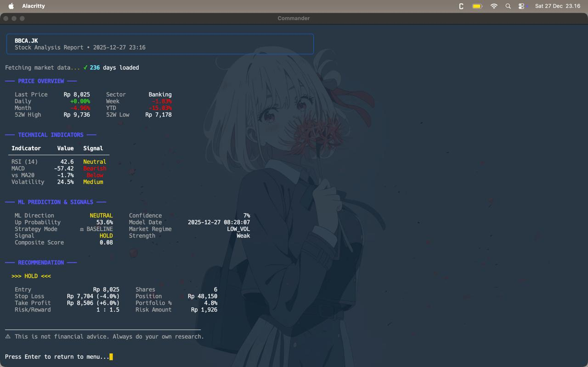

# Paperium: IHSG Quantitative Trading System


Paperium is a high-performance quantitative trading system designed for the Indonesia Stock Exchange (IHSG). It leverages advanced machine learning (XGBoost) to predict short-term price movements and manage a modular trading portfolio.

## Key Architecture

Paperium uses a streamlined, high-performance architecture centered around a single, robust machine learning model:

-   **The Predictor (XGBoost):** A sophisticated Gradient Boosting model that analyzes dozens of technical indicators and historical price patterns to predict the probability of a positive return on the next trading day.
-   **Hybrid Strategy Intelligence:** Uses dual-mode signal processing:
    -   **Strategy A (The Sniper):** High-confidence (score > 0.75), higher-conviction bets on rare explosive moves (🔥). Increases position sizing and aims for larger targets.
    -   **Strategy B (The Grinder):** Consistent baseline signals to capture steady market moves (⚖️).

## Project Structure

-   `data/`: Data ingestion from Yahoo Finance and SQLite storage.
-   `ml/`: Core XGBoost model implementation and feature engineering.
-   `signals/`: Technical indicator generation and stock screening.
-   `strategy/`: Position management, exit logic (SL/TP), and portfolio sizing.
-   `scripts/`: Automation scripts for daily rituals and model optimization.
-   `models/`: Storage for trained champion models.

---

## Requirements:

1. python 3
2. uv package manager

### Setup

```bash
# Setup virtual environment
uv venv

# Activate the environment according to your OS

# Install dependency
uv sync
```

## Dashboard
Run the unified runner for an interactive CLI experience:
```bash
uv run python run.py
```

---

## Quick Start Guide

### 0. Initial Setup & Data Prep
Before training or running the bot, you need clean data. Use the dashboard for a guided setup experience.

**Via Dashboard (Recommended):**
```bash
uv run python run.py
# → Select "Initial Setup & Data Prep"
# → Run options 1-3 in order
```

**Manual Setup:**
```bash
# 1. Clean the stock list (removes illiquid/suspended stocks)
uv run python scripts/clean_universe.py

# 2. Fetch 5 years of daily historical data
uv run python scripts/sync_data.py

# 3. Download IHSG index for market crash detection (Gen 7+)
uv run python scripts/download_ihsg.py --days 1825
```

### 0.1 Weekly Hour-0 Pattern Analysis (Optional - Enhances Model)
**What it does:** Fetches real intraday (hourly) data to capture the IDX Session-1 "pop and fade" pattern (9-11 AM). This adds 5 powerful features to your model based on actual hourly price action.

**When to run:** Weekly (every Monday morning) to keep Hour-0 metrics fresh.

**How to run:**
```bash
# Via Dashboard
uv run python run.py
# → Select "Initial Setup & Data Prep"
# → Select "4. Analyze Hour-0 Patterns"
# → Analyze all tickers? Yes (default)
# → Days: 60 (max available from Yahoo Finance)
# → Wait ~5 minutes (safe rate limiting: 10 stocks every 3 seconds)

# Or via command line
# All tickers (default - fetches from universe dynamically)
uv run python scripts/analyze_hour0.py --days 60

# Or for faster testing (top 200 liquid stocks only):
uv run python scripts/analyze_hour0.py --stocks 200 --days 60
```

**What you get:**
- 5 new features: `h0_spike_pct`, `h0_fade_pct`, `h0_net_pct`, `h0_spike_is_day_high`, `h0_spike_to_close`
- Metrics stored in database (automatically used by training/eval/signals)
- Statistics showing average spike/fade patterns

**Safety:**
- Rate limited to prevent Yahoo Finance bans (10 stocks/batch, 3 sec delay)
- Only fetches 60 days (Yahoo's hourly data limit)
- Default analyzes all tickers from universe dynamically (~956 tickers = ~5 minutes)
- Can reduce to top N liquid stocks for faster analysis (e.g., 200 = ~2 minutes)

**Note:** Models automatically detect and use Hour-0 features when available. No special flags needed for training.


### 1. Model Training
Train the global XGBoost model using historical data. The system automatically detects and uses Hour-0 features if available.

```bash
# Targeted training (90 days eval)
uv run python scripts/train.py --days 90 --target 0.85

# Max window training (starting from previous Dec 1st)
uv run python scripts/train.py --days max --train-window max

# Training automatically uses:
# - GEN 7 (51 features): Intraday proxies + crash filter + volatility targeting
# - GEN 8 (56 features): GEN 7 + Hour-0 metrics (if hour0_metrics table exists)
```

**Feature Set Auto-Detection:**
- Training automatically detects Hour-0 data and upgrades to GEN 8
- No flags needed - just run Hour-0 analysis weekly and train as usual
- Banner shows which generation is active (GEN 7 or GEN 8)

**Training Session Tracking:**
Each training session automatically creates a JSON file in `models/training_session_YYYYMMDD_HHMMSS.json` that captures:
- All iteration metrics (Win Rate, W/L Ratio, Sharpe, etc.)
- Monthly performance breakdown
- Exit statistics
- Training parameters

**Visualize Training Progress:**

*Terminal Viewer (Quick):*
```bash
# Interactive mode - select from available sessions (displays in terminal)
uv run python scripts/view_training.py

# Or access via dashboard: run.py → Option 6
```

*Graphical Plots (For Reports):*
```bash
# Interactive mode - select from available sessions
uv run python scripts/plot_training.py

# Plot a specific session
uv run python scripts/plot_training.py models/training_session_20241228_120000.json

# Save plot to file
uv run python scripts/plot_training.py models/training_session_20241228_120000.json --save training_plot.png
```

#### Customizing Your Model

Want to tweak the model to match your trading style? Here are the key parameters you can adjust:

##### 📁 **File: `config.py`**

**XGBoost Model Parameters** (Line 54-61):
```python
# Conservative (Gen 5 default - stable, less overfitting)
n_estimators: int = 100      # Number of trees (↑ = more complex)
max_depth: int = 5            # Tree depth (↑ = more patterns, risk overfitting)
learning_rate: float = 0.1    # Learning speed (↓ = slower but stable)
min_child_weight: int = 3     # Min samples per leaf (↑ = more conservative)

# Aggressive (more patterns, higher risk)
n_estimators: int = 200
max_depth: int = 7
learning_rate: float = 0.05
```

##### 📁 **File: `signals/screener.py`**

**Stock Filtering Criteria** (Line 19-21):
```python
# Relaxed (more stocks, more noise)
self.min_price = 50           # Minimum stock price (↓ = include penny stocks)
self.min_volume = 1_000_000   # Daily volume (↓ = include illiquid stocks)

# Strict (fewer stocks, higher quality)
self.min_price = 200
self.min_volume = 5_000_000
```

##### 📁 **File: `scripts/eval.py`**

**Risk Management** (Line 78-84):
```python
# Conservative (smaller losses, smaller gains)
self.stop_loss_pct = 0.03     # 3% max loss per trade
self.take_profit_pct = 0.06   # 6% profit target
self.max_hold_days = 3        # Exit after 3 days

# Aggressive (bigger swings)
self.stop_loss_pct = 0.07     # 7% max loss
self.take_profit_pct = 0.15   # 15% profit target
self.max_hold_days = 10       # Hold longer
```

**Buy Signal Threshold** (Line 591):
```python
# Relaxed (more signals, lower quality)
if prediction_score > 0.05:   # Buy threshold (↓ = more trades)

# Strict (fewer signals, higher quality)
if prediction_score > 0.20:   # Buy threshold (↑ = fewer trades)
```

**Portfolio Settings** (Line 78-80):
```python
self.max_positions = 10       # Max concurrent stocks (↑ = more diversification)
self.buy_fee = 0.0015         # 0.15% buy fee (adjust to your broker)
self.sell_fee = 0.0025        # 0.25% sell fee
```

##### 🎯 **Trading Style Presets**

| Style | max_depth | threshold | SL | TP | max_hold |
|-------|-----------|-----------|----|----|----------|
| **Conservative** | 5 | 0.15 | 3% | 6% | 3 days |
| **Balanced** (Gen 5) | 5 | 0.10 | 5% | 8% | 5 days |
| **Aggressive** | 7 | 0.05 | 7% | 12% | 10 days |

**Pro Tip**: After changing parameters, always retrain the model and backtest before going live!

### 2. Evaluation
Verify performance over a specific period:
```bash
uv run python scripts/eval.py --start 2024-01-01 --end 2025-09-30
```
### 3. Morning Ritual (Live Signals)
Generate trading recommendations before market open:
```bash
uv run python scripts/morning_signals.py
```


### 4. Single Stock Analysis
Deep-dive into any IHSG stock with comprehensive analysis:
```bash
uv run python scripts/analyze.py BBCA.JK --portfolio 100000000
```
This provides:
-   **Basic Info:** Price, sector, 52W range, returns
-   **Technical Analysis:** RSI, MACD, Moving Averages, Volatility
-   **ML Prediction:** XGBoost probability and confidence
-   **Signal Analysis:** Composite score and buy/sell signal
-   **Market Regime:** Current volatility regime (HIGH_VOL/LOW_VOL/NORMAL)
-   **Recommendation:** Position sizing, stop-loss, and take-profit levels



---

## Detailed Workflow

See [Presentation](presentation.md) for more details.

### Phase 1: Data Preparation
The `DataFetcher` retrieves the latest OHLCV data for the IHSG stock universe. Features are calculated via a self-contained `FeatureEngineer`, which internally generates 46 core indicators (RSI, MACD, ATR, SMA, etc.), ensuring 100% consistency between training and live inference.

### Phase 2: Signal Generation
1.  **Screener:** Filters out illiquid or stable stocks based on volume and price volatility.
2.  **XGBoost Prediction:** The champion model generates a "confidence score" (0-100%) for each remaining stock.
3.  **Ranking:** Stocks are ranked based on their ML score and technical consensus.

### Phase 3: Position Management
The `PositionManager` executes trades based on the top-ranked signals. Each position is protected by:
-   **Trailing Stop Loss:** Dynamic SL based on ATR or percentage.
-   **Take Profit:** Fixed or dynamic TP targets.
-   **Time Stop:** Automatic exit after a set number of days to ensure capital velocity.

### Phase 4: Evening Self-Refinement
Every evening after market close, the `eod_retrain.py` script:
1.  Evaluates current positions and updates P&L.
2.  Incorporate today's price action into the training pool.
3.  Performs a "Champion Challenge": Trains a new model and only replaces the current one if it shows superior validation accuracy.

---

## Key Directories
- `/models`: Stores your `.pkl` Champion models.
- `/.cache`: Stores hourly price snapshots for faster execution.
- `/data`: Your SQLite database (`ihsg_trading.db`) containing price history.

---
*Disclaimer: Trading stocks involves significant risk. This bot is a tool for decision support. Always use Test Mode before committing to live trading.*
