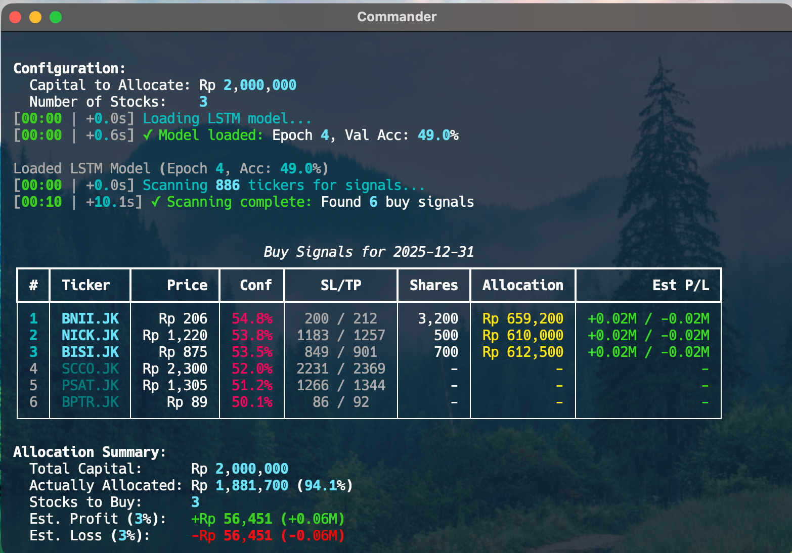
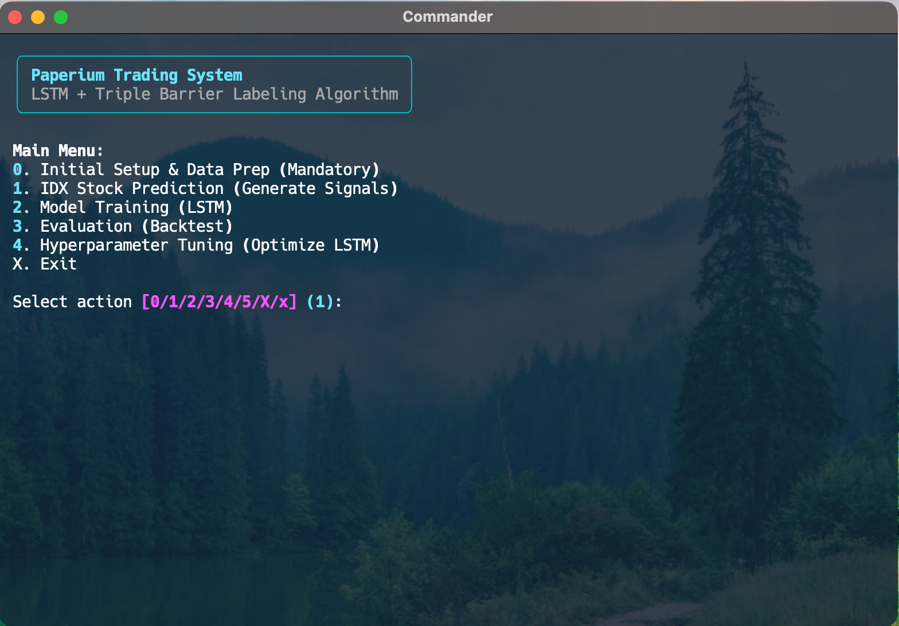
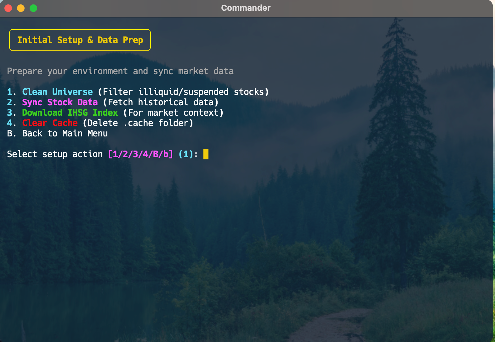
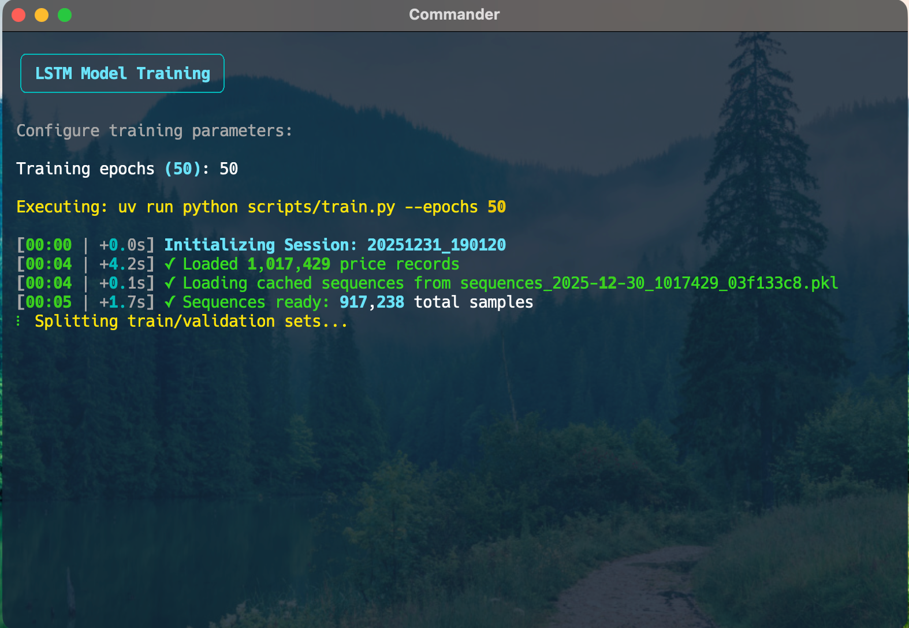
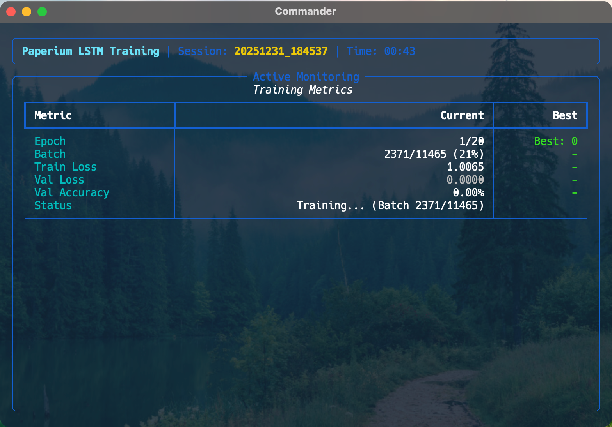
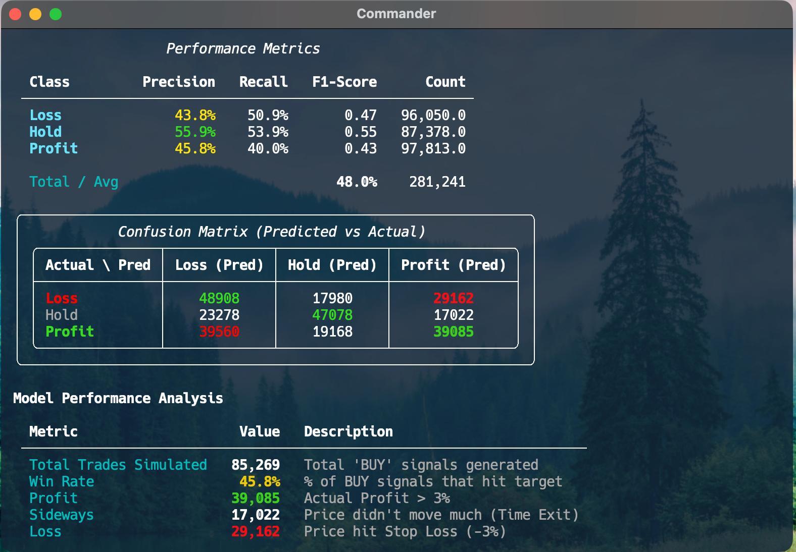
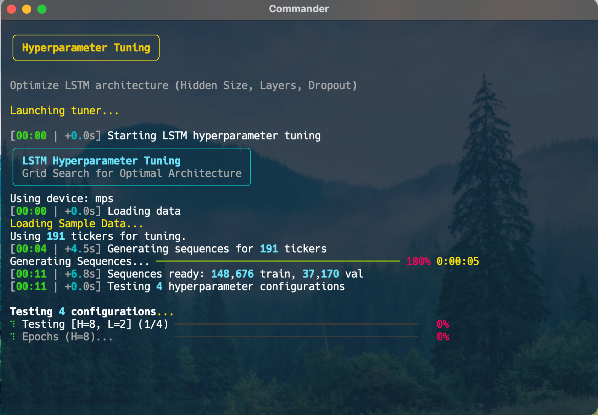

# Paperium: IHSG Deep Learning Trading System


**System Type**: Deep Learning Quantitative Trading
**Target Market**: Indonesia Stock Exchange (IHSG)
**Model Architecture**: LSTM (Long Short-Term Memory)
**Labeling Scheme**: Triple Barrier Method

Paperium is a sophisticated quantitative trading system for the Indonesia Stock Exchange (IHSG). It implements state-of-the-art Deep Learning (LSTM) trained on raw OHLCV sequences, guided by **Triple Barrier Labeling**, as described in recent financial machine learning research.

Paper: https://arxiv.org/pdf/2504.02249v1



> [!IMPORTANT]  
> For Paperium XGBoost version especially gen 4 and prior, go to the bottom page.

## Table of Contents

1. [Core Philosophy](#core-philosophy)
2. [Key Innovations](#key-innovations)
3. [Architecture](#architecture)
4. [Quick Start](#quick-start)
5. [Usage Guide](#usage-guide)
6. [Model Details](#model-details)
7. [Data Pipeline](#data-pipeline)
8. [Training Strategy](#training-strategy)
9. [Portfolio Management](#portfolio-management)
10. [Configuration](#configuration)
11. [Performance Optimization](#performance-optimization)
12. [Known Issues & Future Work](#known-issues--future-work)
13. [Gen 4 Paperium XGBoost](#gen4-paperium-xgboost)

## Core Philosophy

Paperium has transitioned from traditional ML (XGBoost + Technical Indicators) to **Deep Learning on Raw Data**. The hypothesis is that neural networks can learn better feature representations from raw price sequences than human-engineered indicators (RSI, MACD, etc.).

By feeding the LSTM raw OHLCV data, we avoid:

- Feature selection bias
- Over-engineering indicators
- Look-ahead bias from complex transformations

The model learns temporal patterns directly from market data.

## Key Innovations

### 1. Deep Learning Core

Uses a 2-layer LSTM (Long Short-Term Memory) network instead of traditional tree-based models (XGBoost). LSTMs excel at capturing long-term dependencies in time-series data.

### 2. Raw Data Input

Eliminates "feature engineering" bias. The model learns directly from 100-day sequences of raw Open, High, Low, Close, Volume (OHLCV) data.

### 3. Triple Barrier Labeling (TBL)

Instead of fixed "Close-to-Close" returns, we use TBL to capture the path dependency of trading.

- **Barrier 1 (Profit)**: +3% gain within horizon
- **Barrier 2 (Loss)**: -3% loss within horizon
- **Barrier 3 (Time)**: 5-day expiration (neutral)
- **Result**: The model predicts the probability of hitting the profit barrier **first**

**How it works:**

- If High > Entry × 1.03 first → Label 2 (PROFIT)
- If Low < Entry × 0.97 first → Label 0 (LOSS)
- If neither happens by Day 5 → Label 1 (NEUTRAL)

**Optimization**: 3% / 5 days found to be the sweet spot for IHSG volatility.

## Architecture

### Directory Structure

```
paperium/
├── data/              # Data storage and fetching
│   ├── fetcher.py         - Yahoo Finance API integration
│   ├── storage.py         - SQLite database operations
│   ├── universe.py        - Stock universe definitions
│   └── ihsg_trading.db    - Price data storage
│
├── ml/                # Machine Learning components
│   ├── model.py           - PyTorch LSTM implementation
│   └── features.py        - Sequence generation & TBL logic
│
├── signals/           # Signal generation
│   ├── screener.py        - Liquidity & circuit breaker filters
│   └── combiner.py        - Signal aggregation (Pure ML confidence)
│
├── strategy/          # Portfolio management
│   ├── position_manager.py - Trade state persistence
│   └── position_sizer.py   - Volatility-adjusted sizing
│
├── scripts/           # Executable workflows
│   ├── train.py           - Main training loop (PyTorch)
│   ├── tune_lstm.py       - Hyperparameter optimization
│   ├── eval.py            - Backtesting engine
│   ├── signals.py         - Stock prediction signals (ML-based)
│   ├── eod_retrain.py     - Evening updates (post-market)
│   ├── sync_data.py       - Data synchronization
│   ├── download_ihsg.py   - Index data fetching
│   ├── optimize_tbl.py    - Barrier optimization tool
│   └── clean_universe.py  - Universe filtering
│
├── utils/             # Shared utilities
│   └── logger.py          - Timestamped logging
│
├── models/            # Trained model checkpoints
│   └── best_lstm.pt       - Production model
│
├── run.py             # Main entry point (Interactive CLI)
└── config.py          # System configuration
```

### Component Status

| Component               | Status     | Notes                                    |
| ----------------------- | ---------- | ---------------------------------------- |
| **Data Fetcher**        | Stable     | SQLite backend with hourly caching       |
| **Screener**            | Simplified | Blacklist filtering for illiquid stocks  |
| **Feature Engineering** | Replaced   | Generates sequences + TBL labels         |
| **Model**               | PyTorch    | Saved as `best_lstm.pt`                  |
| **Training**            | Active     | `train.py` handles loop & early stopping |
| **Evaluator**           | Active     | `eval.py` runs walk-forward backtest     |
| **Signal Generator**    | Active     | `signals.py` with confidence weighting   |

## Quick Start

### 1. Installation

```bash
# Install dependencies using uv
uv sync
```

Dependencies: PyTorch, Pandas, NumPy, Rich, yfinance, scikit-learn, SQLite3

### 2. Initial Setup

```bash
# Launch interactive menu
uv run python run.py
```



Select **Option 0: Initial Setup & Data Prep**, then:

1. **Clean Universe** - Filter illiquid/suspended stocks
2. **Sync Stock Data** - Fetch historical data (5 years recommended)
3. **Download IHSG Index** - Market context data



### 3. Train Your First Model

From the main menu, select **Option 2: Model Training**

Choose:

- **Fresh training**: Start new model from scratch
- **Retrain**: Continue from existing `best_lstm.pt`
- Set epochs (default: 50)



The training dashboard will show:

- Real-time loss/accuracy metrics
- Batch-level progress
- Time elapsed/remaining
- Early stopping status



### 4. Generate Trading Signals

From the main menu, select **Option 1: IDX Stock Prediction**

This will:

- Load the trained model
- Scan the stock universe (filtered by blacklist)
- Generate ML-based buy signals
- Display predictions with confidence scores
- Optionally allocate capital across top N stocks with confidence weighting


## Usage Guide

### Main Workflows

#### Stock Prediction Signals

**When:** Before market opens (08:30 WIB) or anytime for analysis

```bash
# Basic mode - show all signals from database
uv run python scripts/signals.py

# Fetch latest data from Yahoo Finance first
uv run python scripts/signals.py --fetch-latest

# With capital allocation (confidence-weighted)
uv run python scripts/signals.py --capital 100000000 --num-stock 5

# Fetch latest + allocate capital
uv run python scripts/signals.py --fetch-latest --capital 50000000 --num-stock 3
```

**What it does:**

- Optionally fetches latest market data from Yahoo Finance
- Runs LSTM inference on all tickers
- Filters blacklisted stocks (illiquid/suspended)
- Ranks signals by confidence (Class 2 probability > 50%)
- With allocation: confidence-weighted capital distribution across top N stocks

**Output (with allocation):**

```
Configuration:
  Capital to Allocate: Rp 100,000,000
  Number of Stocks:    5

Buy Signals for 2025-01-01
┏━━━┳━━━━━━━━┳━━━━━━━━━━━┳━━━━━━┳━━━━━━━━━━━┳━━━━━━━━┳━━━━━━━━━━━━━━┳━━━━━━━━━━━━━━━━━━━┓
┃ # ┃ Ticker ┃   Price   ┃ Conf ┃   SL/TP   ┃ Shares ┃  Allocation  ┃     Est P/L       ┃
┡━━━╇━━━━━━━━╇━━━━━━━━━━━╇━━━━━━╇━━━━━━━━━━━╇━━━━━━━━╇━━━━━━━━━━━━━━╇━━━━━━━━━━━━━━━━━━━┩
│ 1 │ BBCA   │ Rp 9,500  │ 72%  │ 9215/9785 │ 4,000  │ Rp 38,000,000│ +1.14M / -1.14M   │
│ 2 │ ASII   │ Rp 5,200  │ 65%  │ 5044/5356 │ 5,800  │ Rp 30,160,000│ +0.90M / -0.90M   │
│ 3 │ BBRI   │ Rp 4,800  │ 58%  │ 4656/4944 │ 4,100  │ Rp 19,680,000│ +0.59M / -0.59M   │
└───┴────────┴───────────┴──────┴───────────┴────────┴──────────────┴───────────────────┘

Allocation Summary:
  Total Capital:      Rp 100,000,000
  Actually Allocated: Rp 87,840,000 (87.8%)
  Stocks to Buy:      5
  Est. Profit (3%):   +Rp 2,635,200 (+2.64M)
  Est. Loss (3%):     -Rp 2,635,200 (-2.64M)
```

**Key Features:**

- **Blacklist Filtering:** Automatically excludes 72 illiquid/suspended stocks
- **Confidence Weighting:** Higher confidence signals get larger allocation
- **Latest Data:** Optional `--fetch-latest` ensures up-to-date predictions
- **Flexible Display:** Shows all signals or only allocated positions

#### Model Training

**Command line:**

```bash
# Fresh training
uv run python scripts/train.py --epochs 50

# Retrain from best model
uv run python scripts/train.py --epochs 50 --retrain

# Resume from specific checkpoint
uv run python scripts/train.py --resume models/session_X/last.pt
```

**Interactive menu:**

```bash
uv run python run.py
# Select: 2. Model Training
```

**Features:**

- Real-time training dashboard with batch progress
- Timestamped logging for performance tracking
- Automatic early stopping (patience: 10 epochs)
- Session management (saves to `models/training_session_<timestamp>/`)
- Best model saved to `models/best_lstm.pt`
- Sequence caching (dramatically speeds up subsequent runs)

**Dashboard example:**

```
[00:00 | +0.0s] Initializing Session: 20251231_143022
[00:01 | +1.2s] ✓ Loaded 1,234,567 price records
[00:02 | +0.9s] ✓ Loading cached sequences
[00:03 | +0.8s] ✓ Sequences ready: 45,678 total samples
[00:04 | +1.1s] ✓ Data Loaded: 36,542 train, 9,136 val
[00:05 | +1.2s] ✓ Model ready on device: mps
[00:05 | +0.1s] Starting training for 50 epochs...

╭─ Paperium LSTM Training | Session: 20251231_143022 | Time: 02:15 ─╮
│             Training Metrics                                       │
│ ┏━━━━━━━━━━━━━━┳━━━━━━━━━━━━━━━━━┳━━━━━━━━━━━━━━━━┓               │
│ ┃ Metric       ┃         Current ┃           Best ┃               │
│ ┃ Epoch        ┃           15/50 ┃        Best: 12┃               │
│ ┃ Batch        ┃     127/200 (63%)┃             - ┃               │
│ ┃ Train Loss   ┃          0.8234 ┃             - ┃               │
│ ┃ Val Loss     ┃          0.7891 ┃         0.7654┃               │
│ ┃ Val Accuracy ┃          68.23% ┃             - ┃               │
│ └──────────────┴─────────────────┴────────────────┘               │
╰────────────────────────────────────────────────────────────────────╯
```

#### Evaluation & Backtesting

```bash
uv run python scripts/eval.py --start 2024-01-01 --end 2025-12-31
```

**What it does:**

- Walk-forward testing on historical data
- Simulates real trading conditions
- Reports win rate, average return, Sharpe ratio



#### Hyperparameter Tuning

```bash
uv run python scripts/tune_lstm.py
```



**Tests combinations of:**

- Hidden sizes: [4, 8, 16, 32]
- Number of layers: [1, 2, 3]
- Dropout rates: [0.0, 0.1, 0.2]

**Output:** Best configuration based on validation loss

#### Evening Update (Post-Market)

```bash
uv run python scripts/eod_retrain.py
```

**What it does:**

- Fetches latest EOD data
- Updates position statuses (SL/TP hits)
- Checks if retrain trigger is met
- Optionally retrains model with fresh data

## Model Details

### LSTM Architecture

**Input Shape:** `(Batch, 100, 5)`

- 100 days of lookback
- 5 features: Open, High, Low, Close, Volume (normalized)

**Network Layers:**

```
Input (100, 5)
    ↓
LSTM Layer 1: hidden_size=8
    ↓
LSTM Layer 2: hidden_size=8
    ↓
Fully Connected Layer
    ↓
Softmax (3 classes)
```

**Output Classes:**

- **Class 0**: LOSS - Hit lower barrier first (-3%)
- **Class 1**: NEUTRAL - Time expired (5 days)
- **Class 2**: PROFIT - Hit upper barrier first (+3%)

### Why Small Hidden Size?

Financial data is extremely noisy. Large networks (32+ units) tend to overfit. Testing showed hidden_size=8 provides:

- Best generalization
- Fastest training
- Lowest validation loss

## Data Pipeline

### 1. Ingestion

**Source:** Yahoo Finance API via `yfinance`

**Fetching:**

```python
from data.fetcher import DataFetcher
fetcher = DataFetcher(stock_universe)
data = fetcher.fetch_batch(days=1825)  # 5 years
```

**Caching:**

- Hourly pickle cache in `.cache/` folder
- Cache key includes date + hour + ticker hash
- Speeds up repeated fetches from ~5 min to <1 sec

### 2. Storage

**Database:** SQLite (`data/ihsg_trading.db`)

**Schema:**

```sql
CREATE TABLE prices (
    id INTEGER PRIMARY KEY,
    date TEXT NOT NULL,
    ticker TEXT NOT NULL,
    open REAL,
    high REAL,
    low REAL,
    close REAL,
    volume INTEGER,
    created_at TEXT DEFAULT CURRENT_TIMESTAMP,
    UNIQUE(date, ticker)
);
```

**Indexing:**

- `idx_prices_date`
- `idx_prices_ticker`

### 3. Normalization

**Prices:** Normalized relative to first day of 100-day window

```python
normalized_price = (price_t / price_0) - 1
```

**Volume:** Log-normalized

```python
normalized_volume = log(volume + 1)
```

### 4. Sequence Generation

**Rolling Window:**

- Size: 100 days
- Stride: 1 (overlapping sequences)
- Creates multiple training samples per ticker

**Triple Barrier Labeling:**

```python
def get_label(entry_price, future_prices, horizon=5, barrier=0.03):
    upper = entry_price * (1 + barrier)  # +3%
    lower = entry_price * (1 - barrier)  # -3%

    for day in range(1, horizon + 1):
        if future_prices[day]['high'] >= upper:
            return 2  # PROFIT
        if future_prices[day]['low'] <= lower:
            return 0  # LOSS

    return 1  # NEUTRAL (time expired)
```

### 5. Train/Validation Split

**Method:** Time-ordered (chronological)

- Training: First 80%
- Validation: Last 20%

**Why not random?**
Prevents look-ahead bias. In finance, future data cannot inform past decisions.

## Training Strategy

### Optimizer & Loss

**Optimizer:** Adam

- Learning rate: 0.001
- No weight decay

**Loss Function:** Cross Entropy Loss

```python
loss = CrossEntropyLoss()(predictions, labels)
```

**Batch Size:** 64

### Early Stopping

**Patience:** 10 epochs

If validation loss doesn't improve for 10 consecutive epochs, training stops automatically.

**Why?**

- Prevents overfitting
- Saves compute time
- Best model is already saved

### Device Selection

Auto-detects available hardware:

```python
if torch.backends.mps.is_available():
    device = "mps"  # Apple Silicon
elif torch.cuda.is_available():
    device = "cuda"  # NVIDIA GPU
else:
    device = "cpu"
```

### Checkpointing

**Auto-save:**

- `models/best_lstm.pt` - Best validation loss
- `models/training_session_<timestamp>/best.pt` - Session best
- `models/training_session_<timestamp>/last.pt` - Latest epoch

**Resume training:**

```bash
uv run python scripts/train.py --resume models/training_session_X/last.pt
```

## Signal Generation & Capital Allocation

### Confidence-Weighted Allocation

When both `--capital` and `--num-stock` parameters are provided, the system allocates capital proportionally to signal confidence:

**Formula:**

```python
# Calculate weights based on confidence
total_confidence = sum(signal['conf'] for signal in top_N_signals)
weight_i = signal_i['conf'] / total_confidence

# Allocate capital
allocation_i = total_capital × weight_i
shares_i = int(allocation_i / price_i / 100) × 100  # Round to lots
```

**Example:**

If you have Rp 100M to allocate across 3 stocks:

- Stock A (confidence: 75%) → Gets ~43% of capital
- Stock B (confidence: 60%) → Gets ~34% of capital
- Stock C (confidence: 50%) → Gets ~23% of capital

**Lot Size:** 100 shares (standard IDX lot)

### Blacklist Filtering

Automatically excludes 72 illiquid/suspended stocks defined in `data/blacklist.py`:

```python
from data.blacklist import BLACKLIST_UNIVERSE

if ticker in BLACKLIST_UNIVERSE:
    continue  # Skip blacklisted stock
```

**Blacklisted tickers include:** Penny stocks, suspended trading, low liquidity, high manipulation risk.

### Risk Parameters

**Per Position (from TBL):**

- **Stop Loss:** Entry price × 0.97 (-3%)
- **Take Profit:** Entry price × 1.03 (+3%)
- **Max Hold Period:** 5 days
- **Confidence Threshold:** >50% for Class 2 (PROFIT)

**Estimated P/L Calculation:**

```python
estimated_profit = allocation × tbl_barrier  # +3%
estimated_loss = allocation × tbl_barrier    # -3%
```

## Configuration

### config.py Structure

```python
class DataConfig:
    db_path = "data/ihsg_trading.db"
    window_size = 100      # Days of lookback
    lookback_days = 1825   # Historical fetch (5 years)
    stock_universe = IDX_UNIVERSE

class MLConfig:
    input_size = 5         # OHLCV features
    hidden_size = 8        # LSTM units
    num_layers = 2         # LSTM layers
    num_classes = 3        # LOSS/NEUTRAL/PROFIT
    dropout = 0.0
    batch_size = 64
    learning_rate = 0.001

    # Triple Barrier
    tbl_horizon = 5        # Days
    tbl_barrier = 0.03     # 3% threshold

class PortfolioConfig:
    total_value = 100_000_000  # IDR 100M
    max_positions = 10
```

### Tuning Parameters

**If win rate is low:**

- Increase `tbl_barrier` (e.g., 0.04 = 4%)
- Increase `tbl_horizon` (e.g., 7 days)

**If overfitting:**

- Add `dropout` (e.g., 0.1)
- Decrease `hidden_size` (e.g., 4)

**If underfitting:**

- Increase `hidden_size` (e.g., 16)
- Add more layers

## Performance Optimization

### Sequence Caching

**Problem:** Processing 957 tickers takes 30-60 seconds every training run.

**Solution:** Cache computed sequences to disk.

**Cache Key:**

```python
cache_key = f"sequences_{db_date}_{row_count}_{config_hash}.pkl"
```

**Performance:**

- First run: ~45 seconds (cache miss)
- Subsequent runs: ~1 second (cache hit)

**Cache invalidation:**
Automatic when:

- New data added to database
- Configuration changes (window size, TBL params)

### Data Fetching

**Yahoo Finance caching:**

- Hourly granularity
- Stored in `.cache/` folder
- Reduces API calls from minutes to sub-second

### Training Optimizations

**Progress tracking:**

- Batch-level updates (every 10 batches for training, 5 for validation)
- Prevents UI freezing
- Shows ETA for completion

**Timestamped logging:**

```
[00:00 | +0.0s] Initializing Session
[00:01 | +1.2s] ✓ Data Loaded
[00:45 | +44.1s] ✓ Sequences ready
```

Shows both total elapsed time and step duration.

## Known Issues & Future Work

### Current Limitations

1. **Class Imbalance**

   - In low volatility markets, NEUTRAL class dominates
   - **Solution:** Class weights or focal loss

2. **Inference Speed**

   - LSTM slower than XGBoost (~5-10s for 957 tickers)
   - **Acceptable** for pre-market analysis

3. **Static Parameters**
   - TBL barriers fixed at 3%
   - **Solution:** `optimize_tbl.py` for dynamic optimization

### Planned Enhancements

- **Multi-timeframe analysis** - Add intraday data
- **Ensemble methods** - Combine multiple models
- **Reinforcement learning** - Adaptive position sizing
- **Volatility regime detection** - Adjust barriers by market conditions
- **Transaction cost modeling** - Include brokerage fees

## Gen 4 Paperium XGBoost

You can go to this commit point: https://github.com/snowfluke/paperium/tree/ef88c4fc5be7ad8d322b4c8c0664920f5704e798

But you need to patch the `strategy/position_manager.py` to the dataclass position.

```py
@dataclass
class Position:
    ...
    ...
    id: Optional[int] = None
    updated_at: Optional[str] = None
```

## Performance Notes

### Optimal Hyperparameters

**Window Size:** 100 days

- Too short: Misses long-term patterns
- Too long: Overfits to noise

**Hidden Size:** 8 units

- Small networks prevent overfitting on noisy financial data
- Faster training and inference

**TBL Barriers:** 3% / 5 days

- Tested multiple combinations
- Best balance of frequency and win rate for IHSG

### Training Time

**Dataset:** ~45,000 sequences from 887 tickers

**Hardware:**

- Apple M1 (MPS): ~3 minutes per epoch
- NVIDIA RTX 3080: ~1 minute per epoch
- CPU only: ~10 minutes per epoch

**Typical training:** 20-30 epochs until early stopping

## Contributing

This is a research project. Contributions welcome for:

- Additional technical indicators
- Alternative labeling schemes
- Performance optimizations
- Documentation improvements

## Disclaimer

**This is a research project for educational purposes.**

- Trading involves substantial risk of loss
- Past performance does not guarantee future results
- Always perform your own due diligence
- Never trade with money you cannot afford to lose
- The authors assume no liability for trading losses

**Legal Notice:** Not financial advice. Use at your own risk.

## License

MIT License
